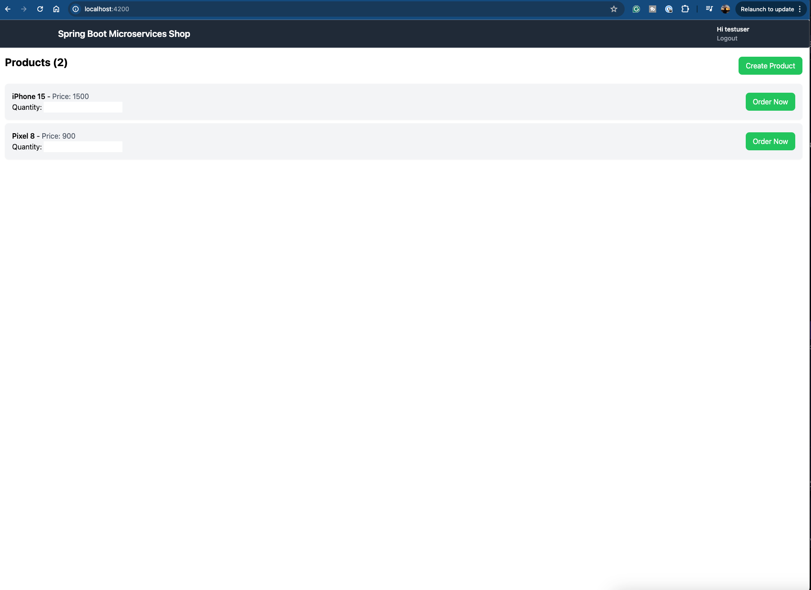

# Microservices Shop Project

This project is a microservices-based e-commerce backend and frontend system. It demonstrates a modular architecture using Spring Boot, Angular, Docker, and Keycloak for authentication.

- Architecture

- Frontend

## Architecture Overview

- **Frontend:** Angular SPA (`microservices-shop-frontend`)
- **API Gateway:** Central entry point for all client requests
- **Auth Server:** Keycloak for authentication and authorization
- **Product Service:** Manages product catalog (MongoDB)
- **Order Service:** Handles order placement (MySQL)
- **Inventory Service:** Manages inventory (MySQL)

## Project Structure

```
microservices project/
│
├── api-gateway/                # Spring Cloud Gateway
├── inventory-service/          # Spring Boot + MySQL
├── order-service/              # Spring Boot + MySQL
├── product-service/            # Spring Boot + MongoDB
└── microservices-shop-frontend/ # Angular 17+ SPA
```


For each service, use the specified port:

- **Frontend** `localhost:4200`
- **API Gateway:** `localhost:9000`
- **Product Service:** `localhost:8080`
- **Order Service:** `localhost:8081`
- **Inventory Service:** `localhost:8082`

## API Documentation

Each service exposes OpenAPI (Swagger) docs:

- Product Service: `/swagger-ui.html`
- Order Service: `/swagger-ui.html`
- Inventory Service: `/swagger-ui.html`

## Authentication

- Keycloak is used for OAuth2 authentication.
- Configure realms, clients, and users in the Keycloak admin console (`http://localhost:8181`).


